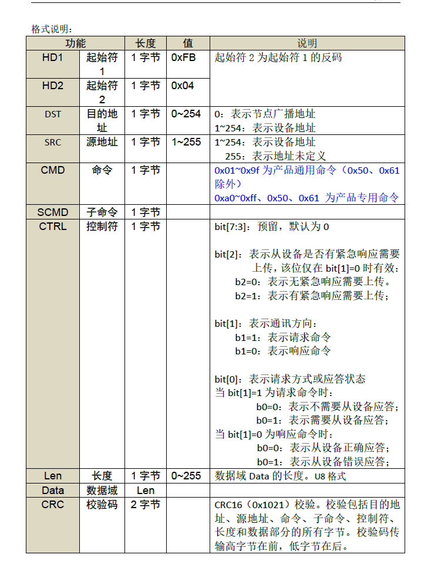

# 分布式在线仪表通信协议
DOIC(Distributed Online Instrument Communication Protocol)协议轻量型通用框架,本协议适用于本公司设备分布式在线设备的通信。协议定义了设备如何接入系统网络，以及数据如何在他们之间传输的标准。
环境要求：

1. 协议版本V1.17-2021-12-24
2. C/C++ 语言,C99语言规范
3. 不申请堆区空间提高兼容性
4. 32位平台上优先获得验证支持

## 网络结构

**RS485：**采用双绞电缆线传输，单主多从结构。。传输速率为57600bps、38400bps、19200bps、9600bps（推荐）、4800bps、2400bps；1 停止位；无校验位。
**CAN：**采用双绞电缆传输，多主多从结构。传输速率为250kbps、125kbps、50kbps、20kbps（推荐）、10kbps。

## master主机说明
