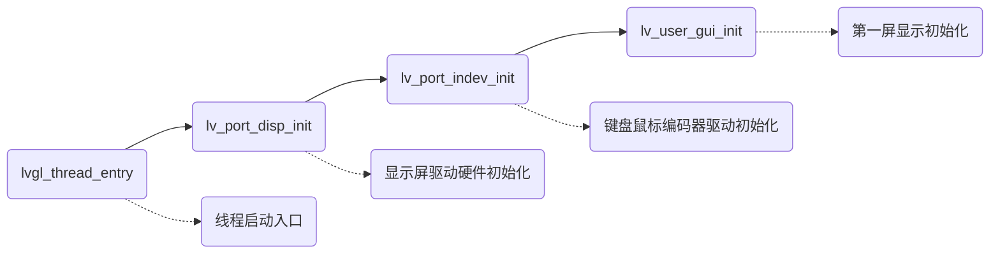

# lvgl用户文件目录说明

版本：8.3.6

日期：2023年8月10日

本文夹属于应用层，用户自行编写或者使用相关辅助设计工具编写的GUI界面，不涉及底层移植部分，请先了解本文件夹结构，了解划分后再维护本项目。

文件夹结构

```sh
.
├── assets		#存放资源数据
├── cache		#缓存 无用
├── components	#自定义组件
├── demo		#演示例程
├── event		#页面的事件操作，人工维护
├── fonts		#字库资源：辅助工具自动维护
├── images		#图片资源：辅助工具自动维护
└── screens		#屏幕界面初始化过程
```

## 辅助设计工具

lvgl的资源文件无需自己手动维护使用辅助设计工具可以自动完成 ./fonts、./images的转换，界面的可视化布局功能，自动根据布局生成代码，用户可以选择直接使用工具生成代码，或者参考使用。

### SquareLine Studio

 版本：1.3.1

类型：lvgl原厂软件

价格：商用包月付费，或者免费但是功能受限，部分组件不可拖放到屏幕

优势：

	1. 虽然功能受限，但是由于原厂支持，所以在使用中可以快速了解其支持的功能，
	1. 自带仿真脱离硬件
	1. 生成的工程代码有助于辅助学习，或者直接应用
	1. 原厂工具支持资源文件等手动生成一键导出
	1. python 、C双版本支持

缺点：

1. 需要联网注册
2. 非付费版功能受限
3. 导出资源需要手动配置字库


### GUI-Guider

版本：GUI-Guider-1.6.0-GA

类型：NXP免费提供

优势: 

1. 字库、图片、视频等资源无需操心转换，根据使用情自动维护
2. 支持大量的lvgl组件，完全免费
3. 演示例程较多，丰富
4. PC仿真
5. python、C双版本支持

缺点：

	1. 生成的代码垃圾配置比较多
	1. layout支持不好，flex grid布局功能未见支持
	1. 阴影轮廓之类的功能配置不支持，需要自己加代码
	1. 部分event不支持

## LVGL工程介绍

程序的入口 lvgl框架已经规划完毕，**packages\LVGL-v8.3.5\env_support\rt-thread\squareline\lv_ui_entry.c**

程序入口

```c
void lv_user_gui_init(void)
{
    extern void ui_init(void);
    ui_init();
}

```

可知我们用户文件夹里的ui.c便是我们程序的启动入口**lv_disp_load_scr**确定了启动的第一屏

```c
///////////////////// SCREENS ////////////////////

void ui_init(void)
{
    lv_disp_t * dispp = lv_disp_get_default();
    lv_theme_t * theme = lv_theme_default_init(dispp, lv_palette_main(LV_PALETTE_BLUE), lv_palette_main(LV_PALETTE_RED),
                                               false, LV_FONT_DEFAULT);
    lv_disp_set_theme(dispp, theme);
    ui_P00startup_screen_init();
    ui____initial_actions0 = lv_obj_create(NULL);
    lv_disp_load_scr(ui_P00startup);
}
```

lvgl完整的启动流程见**packages\LVGL-v8.3.5\env_support\rt-thread\lv_rt_thread_port.c**

线程启动之后完整的启动流程为




### lvgl源码路径简介

```sh
.
├── demos		#演示例程模仿学习
├── docs		#说明文档
├── env_support	#支持的环境
├── examples	#小组件示例
├── scripts		#不知道干啥的
├── src			#源码文件
│   ├── core
│   ├── draw
│   ├── extra	#扩展组件
│   │   ├── layouts #布局
│   │   ├── libs 
│   │   ├── others
│   │   ├── themes #系统主题
│   │   └── widgets#组件
│   ├── font	#自带的默认字库 ASCII
│   ├── hal		#接口层
│   ├── misc	#基础组件
│   └── widgets	#组件
├── tests
└── lv_conf_template.h #用户配置 头文件示例
```

### lv_conf.配置介绍


## 本工程介绍

本工程采用官方软件**SquareLine Studio**设计启动第一屏，后续屏幕设计均参照软件生成的工程作为参考手动完成界面的设计工作，也使用了GUI-Guider参考了解扩展组件的用法
